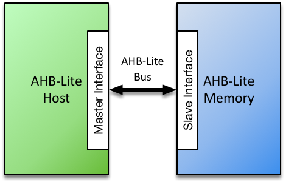
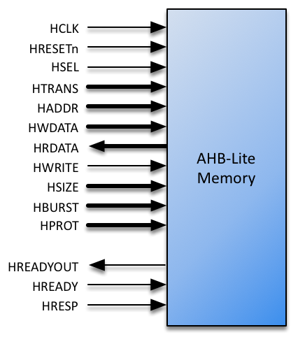

# AHB-Lite Memory Datasheet

## Contents

-   [Introduction](#introduction)
-   [Functional Description](#functional-description)
-   [Configurations](#configurations)
-   [Interfaces](#interfaces)
-   [Technology Support](#technology-support)
-   [Resources](#resources)
-   [Revision History](#revision-history)

## Introduction

The Roa Logic AHB-Lite Memory IP is a fully parameterized soft IP implementing on-chip memory for access by an AHB-Lite based Master. All signals defined in the *AMBA 3 AHB-Lite v1.0* specifications are fully supported.

The IP supports a single AHB-Lite based host connection and enables address & data widths, memory depth & target technology to be specified via parameters. An option to register the memory output is also provided.

### Features

-   Full support for AMBA 3 AHB-Lite protocol

-   Fully parameterized

-   User-defined address and byte-aligned data widths supported

-   Configurable memory depth, limited only by target technology capability

-   Technology-specific memory cells instantiated automatically

-   Combinatorial or registered data output

## Functional Description

The AHB-Lite Memory IP is a flexible, fully configurable, IP that enables designers to attach internal device memory to AHB-Lite based host. The width and depth of the memory, together with an optional registered output stage, are specified via parameters.

The IP is designed to easily support a wide range of target technologies, automatically implementing technology-specific memory cells according to the chosen target. A generic behavioural implementation is also supported.

### AHB-Lite Bus Locking Support

The *AMBA 3 AHB-Lite v1.0* protocol supports bus locking. Typically a locked transfer is used to ensure that a slave does not perform other operations between the read and write phases of a transaction. Given the AHB-Lite Memory IP performs no such operations, bus locking is not supported and does not provide the `HMASTLOCK` input associated with this capability

## Configurations

### Introduction

The size and implementation style of the memory is defined via HDL parameters. These are specified in the following section.

### Core Parameters

| Parameter           | Type    | Default | Description               |
|:--------------------|:--------|:-------:|:--------------------------|
| `MEM_DEPTH`         | Integer |   256   | Memory Depth (Words)      |
| `HADDR_SIZE`        | Integer |    32   | Address Bus Size (Bits)   |
| `HDATA_SIZE`        | Integer |    32   | Data Bus Size (Bits)      |
| `TECHNOLOGY`        | String  | GENERIC | Implementation Technology |
| `REGISTERED_OUTPUT` | String  |    NO   | Is output registered?     |

#### MEM\_DEPTH

`MEM_DEPTH` defines the depth of the memory – i.e. number of `HDATA_SIZE` words to be stored. The maximum depth supported is dependent upon the target technology chosen.

#### HADDR\_SIZE

The `HADDR_SIZE` parameter specifies the address bus size to connect to the AHB-Lite based host. The maximum size supported is 32 bits.

#### HDATA\_SIZE

The `HDATA_SIZE` parameter specifies the data bus size to connect to the AHB-Lite based host. The maximum size supported is 32 bits.

#### TECHNOLOGY

The `TECHNOLOGY` parameter defines the target silicon technology and may be one of the following values:

| Parameter Value | Description                       |
|:----------------|:----------------------------------|
| GENERIC         | Behavioural (FPGA) Implementation |
| N3X             | eASIC Nextreme-3 Structured ASIC  |
| N3XS            | eASIC Nextreme-3S Structured ASIC |

Details of the implementations corresponding to these parameter values can be found in Section 6, Technology Support

#### REGISTERED\_OUTPUT

The `REGISTERED_OUTPUT` parameter defines if the output of the memory is registered on assertion of the HREADY signal. It is specified as ‘YES’ or ‘NO’ (default).

## Interfaces

### AHB-Lite Interface

The AHB-Lite interface is a regular AHB-Lite slave port. All signals are supported. See the *AMBA 3 AHB-Lite Specification* for a complete description of the signals.

| Port        |     Size     | Direction | Description                   |
|:------------|:------------:|:----------|:------------------------------|
| `HRESETn`   |       1      | Input     | Asynchronous active low reset |
| `HCLK`      |       1      | Input     | Clock Input                   |
| `HSEL`      |       1      | Input     | Bus Select                    |
| `HTRANS`    |       2      | Input     | Transfer Type                 |
| `HADDR`     | `HADDR_SIZE` | Input     | Address Bus                   |
| `HWDATA`    | `HDATA_SIZE` | Input     | Write Data Bus                |
| `HRDATA`    | `HDATA_SIZE` | Output    | Read Data Bus                 |
| `HWRITE`    |       1      | Input     | Write Select                  |
| `HSIZE`     |       3      | Input     | Transfer Size                 |
| `HBURST`    |       3      | Input     | Transfer Burst Size           |
| `HPROT`     |       4      | Input     | Transfer Protection Level     |
| `HREADYOUT` |       1      | Output    | Transfer Ready Output         |
| `HREADY`    |       1      | Input     | Transfer Ready Input          |
| `HRESP`     |       1      | Input     | Transfer Response             |

#### HRESETn

When the active low asynchronous `HRESETn` input is asserted (‘0’), the interface is put into its initial reset state.

#### HCLK

`HCLK` is the interface system clock. All internal logic for the AHB-Lite interface operates at the rising edge of this system clock. All AHB-Lite bus timings are related to the rising edge of `HCLK`.

#### HSEL

The AHB-Lite interface only responds to other signals on its bus when `HSEL` is asserted (‘1’). When HSEL is negated (‘0’) the interface considers the bus IDLE and negates `HREADYOUT` (‘0’).

#### HTRANS

HTRANS indicates the type of the current transfer.

| HTRANS | Type   | Description                                                                              |
|:-------|:-------|:-----------------------------------------------------------------------------------------|
| 00     | IDLE   | No transfer required                                                                     |
| 01     | BUSY   | Connected master is not ready to accept data, but intents to continue the current burst. |
| 10     | NONSEQ | First transfer of a burst or a single transfer                                           |
| 11     | SEQ    | Remaining transfers of a burst                                                           |

#### HADDR

`HADDR` is the address bus. Its size is determined by the `HADDR_SIZE` parameter and is driven to the connected peripheral.

#### HWDATA

`HWDATA` is the write data bus. Its size is determined by the `HDATA_SIZE` parameter and is driven to the connected peripheral.

#### HRDATA

`HRDATA` is the read data bus. Its size is determined by `HDATA_SIZE` parameter and is driven by the connected peripheral.

#### HWRITE

`HWRITE` is the read/write signal. `HWRITE` asserted (‘1’) indicates a write transfer.

#### HSIZE

`HSIZE` indicates the size of the current transfer.

| HSIZE | Size    | Description |
|:-----:|:--------|:------------|
| `000` | 8bit    | Byte        |
| `001` | 16bit   | Half Word   |
| `010` | 32bit   | Word        |
| `011` | 64bits  | Double Word |
| `100` | 128bit  |             |
| `101` | 256bit  |             |
| `110` | 512bit  |             |
| `111` | 1024bit |             |

#### HBURST

`HBURST` indicates the transaction burst type – a single transfer or part of a burst.

| HBURST | Type   | Description                  |
|:------:|:-------|:-----------------------------|
|  `000` | SINGLE | Single access                |
|  `001` | INCR   | Continuous incremental burst |
|  `010` | WRAP4  | 4-beat wrapping burst        |
|  `011` | INCR4  | 4-beat incrementing burst    |
|  `100` | WRAP8  | 8-beat wrapping burst        |
|  `101` | INCR8  | 8-beat incrementing burst    |
|  `110` | WRAP16 | 16-beat wrapping burst       |
|  `111` | INCR16 | 16-beat incrementing burst   |

#### HPROT

The `HPROT` signals provide additional information about the bus transfer and are intended to implement a level of protection.

| Bit\# | Value | Description                    |
|:-----:|:-----:|:-------------------------------|
|   3   |   1   | Cacheable region addressed     |
|       |   0   | Non-cacheable region addressed |
|   2   |   1   | Bufferable                     |
|       |   0   | Non-bufferable                 |
|   1   |   1   | Privileged Access              |
|       |   0   | User Access                    |
|   0   |   1   | Data Access                    |
|       |   0   | Opcode fetch                   |

#### HREADYOUT

`HREADYOUT` indicates that the current transfer has finished.

#### HREADY

`HREADY` indicates whether or not the addressed peripheral is ready to transfer data. When `HREADY` is negated (‘0’) the peripheral is not ready, forcing wait states. When `HREADY` is asserted (‘1’) the peripheral is ready and the transfer completed.

#### HRESP

`HRESP` is the instruction transfer response and indicates OKAY (‘0’) or ERROR (‘1’).

## Technology Support

Physical memory implementation in silicon depends on the target technology chosen. The AHB-Lite Memory IP allows a designer to specify either a generic (i.e. behavioural) implementation or one of multiple technology-specific implementations via the `TECHNOLOGY` parameter. This section provides details of these implementations

### GENERIC Implementation

The `GENERIC` option is used to implement regular behavioural HDL allowing both the physical implementation to be controlled during hardware synthesis and full behavioural simulation to be performed. Use this option to infer memories for technologies that support this, like FPGAs.

### eASIC Structured ASIC Support

The IP supports the Nextreme-3 and Nextreme-3S families as described below. Please refer to the relevant technology datasheets for complete details of the memory structures referenced.

#### Nextreme-3 Implementation (N3X)

The Nextreme-3 family of devices features 9Kbit memory blocks, referred to as ‘bRAM’. When the `TECHNOLOGY` parameter is defined as ‘N3X’, all memory will be implemented using 9Kbit bRAM cells.

#### Nextreme-3S Implementation (N3XS)

The Nextreme-3S series of devices features separate 2Kbit and 18Kbit memory blocks, referred to as ‘bRAM2K’ and ‘bRAM18K’ respectively. The choice of which of these blocks are implemented when the `TECHNOLOGY` parameter is defined as ‘N3XS’ is as follows:

| TECHNOLOGY | Memory Size   | Implementation      |
|:----------:|:--------------|:--------------------|
|    N3XS    | ≤4096 bits    | bRAM2K blocks only  |
|    N3XS    | &gt;4096 bits | bRAM18K blocks only |

## Resources

Below are some example implementations for various platforms.

All implementations are push button, no effort has been undertaken to reduce area or improve performance.

| Platform | DFF | Logic Cells | Memory | Performance (MHz) |
|:---------|:----|:------------|:-------|:------------------|
|          |     |             |        |                   |
|          |     |             |        |                   |
|          |     |             |        |                   |

(This table will be complete in future updates to the datasheet)

## Revision History

|     Date    | Rev. | Comments        |
|:-----------:|:----:|:----------------|
| 13-Oct-2017 |  1.0 | Initial Release |
|             |      |                 |
|             |      |                 |
|             |      |                 |
